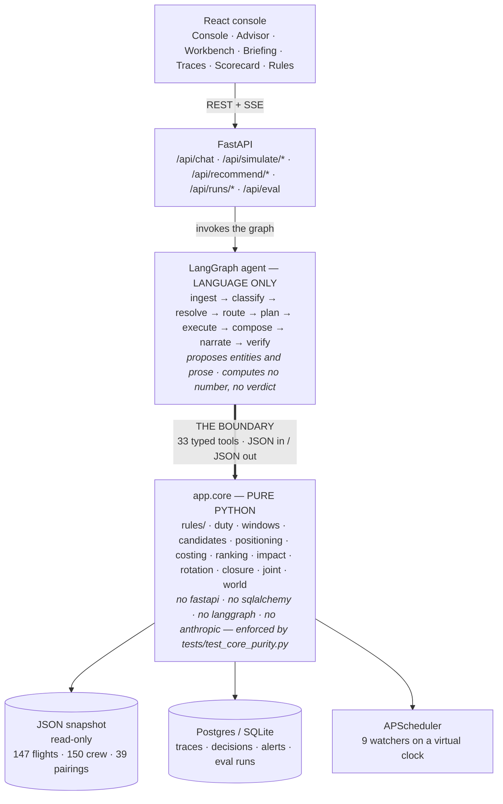
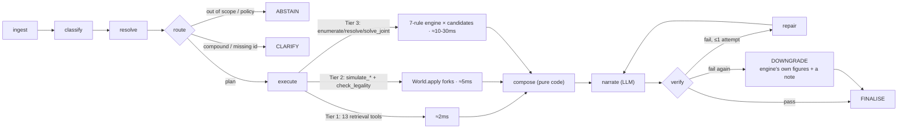
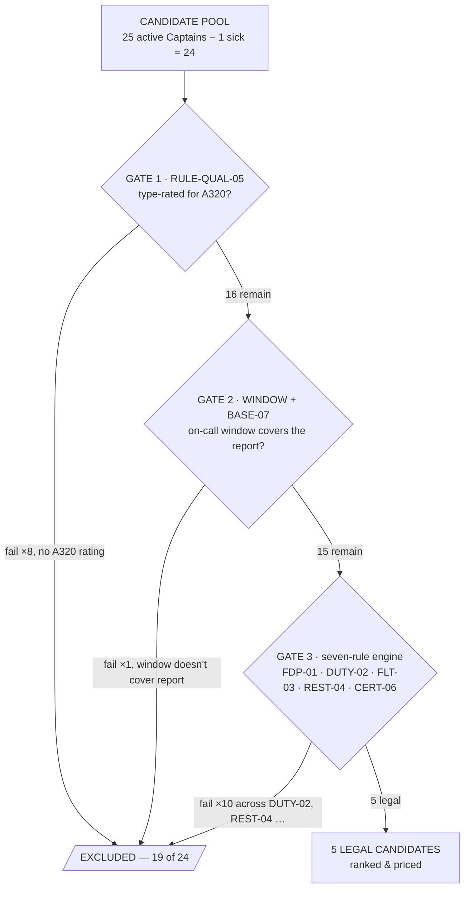
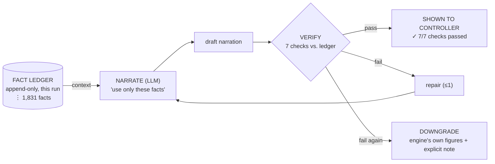
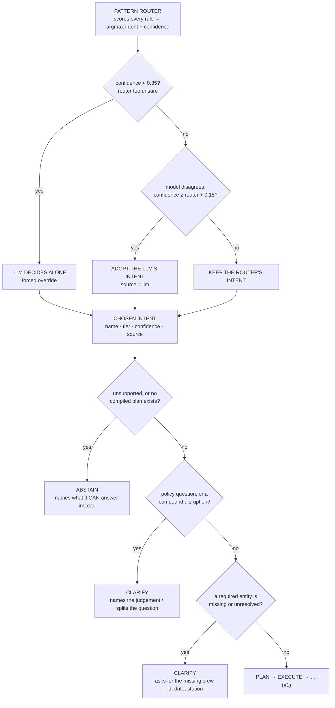

# The Boundary — Crew Ops Advisor system architecture

> The rendered version of this document — the same content as hand-drawn diagrams,
> themed for light/dark — is [`architecture_digram.html`](architecture_digram.html) in
> this same folder. Open it directly in a browser; it has no build step and no external
> dependency beyond a Google Fonts stylesheet (it degrades to system fonts offline).
> This file is the plain-text companion for reading on GitHub or in a terminal.

Every query enters through the same pipeline and crosses the same line: a language
model on one side that classifies and narrates, and **deterministic Python on the
other that computes every number, verdict, cost and ranking**. This document traces
that pipeline through all three question tiers, the mechanism that checks the model's
own words against what the code actually produced, the tool and cron-job inventory,
and the routing decision tree.

| | |
|---|---|
| Engine conformance | **46 / 46** — 38 questions (16 T1 / 14 T2 / 8 T3), 6 worked scenarios, 2 held-out scenarios used once. Calls `app.core` directly, no model, ~60ms total. |
| Live-agent conformance | **36 / 38 (94.7%)** — each question's own English through the real agent, model included, ~2 minutes wall time. |
| Automated tests | **117** passing in ~2s, gating every commit |
| Tools | **33** typed, traced, side-effect-free |
| Proactive watchers | **9**, on a virtual clock |
| Measured latency | 28ms, one Tier-3 recommendation, end to end |

---

## 0. Component view

Five layers, one hard line through the middle. Everything above the line proposes;
everything below it decides. The line isn't a design intention — it's a test
(`tests/test_core_purity.py`) that walks the import graph of `app/core` and fails the
build if it ever imports FastAPI, SQLAlchemy, LangGraph, or Anthropic's SDK.

The operational world (flights, crew, rosters, duty clocks) is a read-only snapshot
loaded once into memory. The database only holds what the system *produces*: traces,
decisions, alerts, eval history. Nothing an answer depends on lives in a table that
could drift from the code that computed it.

---

## 1. The pipeline every question runs

One LangGraph, ten nodes, no exceptions. A lookup and a ranked recommendation enter the
same door — they only diverge for one step, `execute`, and only because they call
different tools. `compose` is pure code in every tier: the structured answer the UI
renders never passes through a model. Only `narrate` touches the LLM, and only to
describe what `compose` already decided.

### What actually changes between tiers

Nothing about the graph. Only which tools `execute` calls and which schema `compose`
reaches for. A Tier-3 recommendation is not a bigger prompt — it's the same pipeline
pointed at a bigger deterministic computation.

| Tier | Example question | Tools called | `compose()` schema | Measured |
|---|---|---|---|---|
| 1 · Lookup | "Who is on reserve at BLR on 15 Sep, and what are their on-call windows?" | `get_reserves` | `reserve_list` | < 5 ms |
| 2 · Consequence | "BLR is closed 08:00–14:00Z on 17 Sep. Which flights are affected?" | `simulate_station_closure` | `closure` | ~8 ms |
| 3 · Recommendation | "Captain C-1042 is out for pairing P-2291. What should I do?" | `resolve_disruption` → 7-rule engine × 24 candidates | `recommendation` | 28 ms |

---

## 2. Inside the rule engine — the flagship case

The candidate pool is **every active crew member of the required rank** — not the
reserve list. Most answer-key options turn out to be day-off callouts of ordinary
line crew; a reserve-only search would return a short, wrong list.

Walking Captain C-1042's sick call for pairing P-2291 through every gate:

| Rank | Crew | Action | Cost | Delay |
|---|---|---|---|---|
| 1 | C-3310 | reserve callout | ₹18,500 | — |
| 2 | C-1526 | day-off callout | ₹24,000 | — |
| 5 | C-2210 | reserve + deadhead (DEL) | ₹41,200 | +3.0h |
| 6 | — | cancel all 6 legs (last resort) | ₹15,00,000 | — |

Every rejection carries a reason string with the rule and the exact arithmetic — not
"trust the model," but **"here are 19 names and the number that disqualified each
one."**

---

## 3. The verification loop

The model's prose is not trusted on arrival. Every scalar any tool produced during the
run — 1,831 of them, on this example — is recorded in an append-only fact ledger.
Before an answer ships, every number, crew id, flight id, pairing id and rule name in
the model's draft is checked against that ledger.

Illustrative catch: a draft claims "40 candidates." `evaluated_count` in the ledger is
24 — no fact matches 40 → rejected, repaired. `app/agent/verify.py` is the gate: a
fluent, confident, wrong number cannot reach the controller, because narration that
references a value the tools never produced fails this check — it is code, not a
style guideline.

---

## 4. Proactive watchers on a virtual clock

The desk in the brief is reactive — something breaks, then a controller reasons about
it. Nine watchers invert that where the data allows: they scan the forward schedule
for conditions that are already true and would otherwise become a 05:00 emergency.

Example — the first alert on the console at start-up: C-5417's recurrent training
expires 17 Sep; they're rostered on P-2213, 19 Sep → **CRITICAL** alert, raised on the
snapshot date, three days before it would otherwise surface as a pre-flight compliance
failure.

| Watcher | Fires when |
|---|---|
| `cert_expiry` | A certificate lapses *before* a duty the crew member is already rostered on |
| `cert_expiring_soon` | Any active crew member's certificate expires within 30 days |
| `duty_limit` | Projected 7-day duty reaches 90% of the 60h RULE-DUTY-02 ceiling within 48h |
| `flight_hours` | 28-day block hours reach 90% of the 100h RULE-FLT-03 ceiling |
| `fdp_margin` | A planned duty sits within 1h of its RULE-FDP-01 limit |
| `reserve_coverage` | Fewer than the needed reserves actually cover a base × rank × report time |
| `rotation_fragility` | A tail's turn time between two legs drops to 1h or under |
| `high_risk_thin_cover` | A high-risk crew member is rostered where legal cover would be scarce/expensive if they dropped out |
| `flagged_roster_exception` | The dataset's own flagged illegal assignment (scenario S5) |

---

## 5. The routing decision tree

Five decision points, evaluated in order, before a single tool ever runs. The first
two decide *who* picks the intent — the deterministic router or the model. The last
three decide whether the system is confident enough to act on it at all. Every one of
them is a plain `if`, not a model call — `app/agent/plans.py:route()` and
`app/agent/graph.py:route_decision()`.

Two guard patterns feed decision 4: `POLICY_RE` catches phrasings like "should we
pre-emptively swap him out" — every input is computable, the threshold isn't in the
ruleset. `COMPOUND_EVENT_RE` catches two disruption verbs joined by "and" — answering
one half confidently is the failure mode this system exists to avoid. Both are
asserted in both directions in `tests/test_routing_and_honesty.py`: they must fire on
these shapes, and they must *not* fire on any of the 38 graded questions.

---

## 6. Tools & scheduled jobs

33 tools the agent can call — every one typed, traced, and side-effect-free — plus
`list_supported_capabilities`, the meta tool that powers honest abstention (decision
3 above). And 3 background jobs that keep the console honest between questions.

| Category | Tools |
|---|---|
| **Retrieval — 14** | `get_crew` · `search_crew` · `get_flight` · `search_flights` · `get_pairing` · `get_roster_for_crew` · `get_duty_clock` · `get_certifications` · `get_reserves` · `get_risk_signal` · `get_rule` · `get_costs` · `network_summary` · `duty_window_scan` |
| **Legality — 4** | `compute_duty_period` · `check_legality` · `check_rest` · `simulate_duty_window` — every one runs the same seven-rule engine as §2; a lookup never re-derives a verdict a different way |
| **Simulation — 6** | `simulate_crew_unavailable` · `simulate_station_closure` · `simulate_delay` · `propagate_rotation` · `simulate_assignment` · `simulate_cancellation` — each forks the world via `World.apply(event)`, so a second event can chain onto the result of the first |
| **Recommendation — 8** | `enumerate_cover_candidates` · `resolve_disruption` · `resolve_delay_breach` · `solve_joint_assignment` · `estimate_cost` · `score_impact` · `draft_notification` · `morning_briefing` |

| Cron job | Cadence | What it does |
|---|---|---|
| `sweep_alerts` | every 300s (virtual clock) | Runs all 9 watchers, upserts the alert board by stable id so an acknowledgement survives the next sweep, auto-resolves anything that no longer fires |
| `nightly_eval` | every 6h | Re-runs the engine conformance suite and records the score — a regression shows up on the scorecard before a person asks |
| `prune_traces` | every 12h | Keeps the last 500 runs; older traces/spans/facts/rule evaluations are dropped |

---

## 7. What makes "reliable" checkable, not asserted

| Mechanism | What it does | Where |
|---|---|---|
| Import-graph test | Walks every module under `app/core` and fails if it imports FastAPI, SQLAlchemy, LangGraph, Anthropic, or any layer above it | `tests/test_core_purity.py` |
| Narration verifier | Extracts every number, crew id, flight id, pairing id and rule name from the model's draft and checks each against the run's fact ledger before the answer ships | `app/agent/verify.py` |
| Honesty guards | A policy question and a compound disruption both route to a clarification instead of a confident half-answer — tested in both directions so a guard tight enough to catch them can't also refuse a real question | `tests/test_routing_and_honesty.py` |
| Deterministic replay | Every tool call is hashed on input and output; `/api/runs/{id}/replay` re-executes the same call against the same snapshot and diffs the hashes | `app/api/routes/observability.py` |

| Check | Result |
|---|---|
| Engine conformance | 46 / 46 — 38 questions (16/14/8 per tier), 6 worked scenarios, 2 held-out used once. `app.core` directly, no model, ~60ms total |
| Live-agent conformance | 36 / 38 (94.7%) sending each question's own English through the real agent, model included, ~2 min wall time. The 2 remaining are genuine model-classification variance on one borderline question — reported honestly rather than chased to a false 100% |
| Automated test suite | 117 tests passing in ~2 seconds |
| Live scorecard | Re-run on demand from the console (`/eval`), both suites above, against the same answer keys, on stage |

---

*Crew Ops Advisor · dCortex Air, hub BLR, week of 2026-09-14 · figures measured against
the shipped dataset and this repository's own test suite.*
